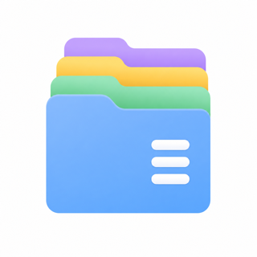

<p align="center">
  
</p>

<h1 align="center">Ordo 安序</h1>

<p align="center">
  <b>English</b> | <a href="README.zh-CN.md">中文</a>
</p>

<p align="center">
  
  
  
  
  
</p>

An Android file manager built with **Flutter + Rust**: the UI is drawn by Flutter, and every file operation is performed by Rust.

- **UI (Flutter)**: Material 3, clean and practical.
- **Core (Rust)**: all filesystem work happens in Rust and is exposed to Flutter over a minimal C ABI with JSON payloads.
- **Non-root friendly**: uses "All files access" (Android 11+) or the legacy read/write permissions, with optional Root / Shizuku / ADB access for restricted folders.

> This project does **not** use Flutter's built-in file I/O APIs and does **not** depend on any file-related third-party package. Dart only handles the UI and FFI calls; reading, writing, copying, moving, deleting, searching, archiving and analysis are all implemented in Rust.

> Built with vibe coding (DeepSeek V4.1 Flash / OpenCode).

## Screenshots

<p>
  
  
  
</p>

## Features

**Local files**
- Browse internal storage, SD cards and USB drives with capacity usage; storage hot-plug is detected and refreshed automatically.
- Quick folders, tappable path breadcrumb, favorites, recent items, in-folder back / forward.
- New folder / file, rename, delete (to the recycle bin by default), create symlinks; multi-select copy / cut / paste with progress and a background transfer queue (cancel / retry).
- Sorting, show / hide hidden files, file color labels, image / video thumbnails.

**Tabs & session**
- Multi-tab browsing with a bottom bar (switch / new / close), plus a **Home** button that jumps straight back to the home page.
- Returning home records the session and shows a **Continue browsing** entry that restores every tab and its location; the in-memory session lives until the app is fully closed.
- Settings → General: **Remember last session** (off by default); **show / hide the tab bar** (hidden = single-tab browsing); and whether opening from Home **appends** to the current session or **resets** it (default reset).
- Back navigation is per screen: the system back walks the current tab's in-page history one step at a time before returning home.

**Viewing & tools**
- In-app preview for images / PDF / audio / text (text can be lightly edited); video and other types go to the system "Open with"; share files.
- EXIF / media info, rotate, save as, set as wallpaper; audio background playback from the notification / lock screen.
- File checksums (SHA-256 / MD5) and on-demand folder size.
- Search: recursive by name, filters (size / time / extensions / kind), full-text content search and saved searches.
- Appearance: theme (system / light / dark / pure black), custom accent color, home layout, list / grid with icon size.
- Default "open with" apps; UI language (system / 简体中文 / English, follows the system by default).

**Archives**
- Create / extract / browse ZIP, TAR and TAR.GZ; ZIP supports AES-256 encryption with an optional password.

**Storage analysis**
- Usage by category, largest files, duplicate detection, smart cleanup (empty files / folders, temp files) and storage trend.

**Remote locations** (WebDAV / FTP / SFTP / SMB — all implemented in Rust)
- Connection management (add / edit / delete, test) with import / export and QR sharing.
- Browse, create, rename and delete like local storage; copy / move between local and remote; remote recursive search by name.
- Remote files can be previewed in-app or downloaded to cache and opened with the system; files dragged in from other apps can be dropped into a remote folder.

**On-device file server** (HTTP/WebDAV + FTP)
- Serve the phone to the LAN: browsers can browse / download, and upload files / create folders.
- Mount as a network drive over WebDAV (Windows / macOS / Linux); FTP supports passive and active modes.
- Multiple users (per-account sub-folder and / or read-only), plus an access log and current connections.

**Security & privacy**
- App lock: verifies the device lock-screen credential on launch and on return to the foreground.
- Private vault: moves files into the app's private directory so they are hidden from regular file managers.
- Secure delete: overwrites file contents before deleting (limited value on SSDs due to wear levelling).

**Privileged modes** (Root / Shizuku / ADB)
- On Android 11+, "All files access" still excludes `Android/data`, `Android/obb` and other apps' `/data/data`; Ordo can borrow a higher privilege to manage them.
- **Root** sees everything; **Shizuku** and **ADB** see `Android/data` and `Android/obb` (ADB needs no Shizuku app — pair once with the code in Developer options).
- All three share one Rust helper process (`ordo-privd`) that talks to the app over a token-protected loopback socket. Configure in Settings → Security & privacy → Privileged mode.

**Diagnostics & drag & drop**
- Uncaught Flutter / Dart errors and Rust panics are logged to a file you can view / export / clear from Settings.
- Drag files from other apps (e.g. the gallery) into an Ordo window and they are copied into the folder you are viewing.

## Notes and limitations

- FTP is plaintext (no FTPS); WebDAV supports HTTPS with an option to trust self-signed certificates. The built-in FTP server is plaintext too — use it on a trusted LAN only.
- SMB share name may be left empty; the connection root then lists every share on the server.
- Connection passwords are stored in plaintext in the app's private directory (`ordo_connections.json`).
- No analytics or telemetry is collected; network traffic only comes from the remote connections you configure and the local file server you start.
- Privileged modes are opt-in and do not survive a reboot. Root sees everything; Shizuku and ADB cannot read other apps' `/data/data`. Deleting inside privileged folders skips the recycle bin, and some direct-read modules (thumbnails, EXIF, archives, analysis) may not work there.
- On some devices that do not expose a USB volume's underlying path to apps, the volume is still listed and marked "access not granted" instead of being hidden (a system limitation).

## Architecture

```
lib/                      Flutter UI and FFI bindings
  src/ffi/native.dart     dart:ffi bindings + background isolate dispatch
  src/services/           filesystem facade / platform channels
  src/state/              browsing state, sorting prefs, clipboard, connections, drag & drop
  src/i18n/               lightweight zh / en localization
  src/ui/                 screens and widgets
rust/                     Rust core (cdylib)
  src/lib.rs              C ABI exports and panic guard
  src/api.rs              local filesystem implementation
  src/vfs.rs              unified facade: local paths and remote URIs share one interface
  src/storage.rs          storage volume discovery (internal / SD card / USB)
  src/importer.rs         drag & drop import (fd -> local / remote)
  src/favorites.rs        favorites persistence
  src/prefs.rs            UI preferences persistence (default open-with app, etc.)
  src/trash.rs            recycle bin (trash / restore / empty)
  src/jobs.rs             long-running job progress and cancellation
  src/archive.rs          archives: ZIP / TAR / TAR.GZ (with AES encryption)
  src/thumbnail.rs        image thumbnail decode and cache
  src/analyze.rs          storage analysis (categories / largest / duplicates)
  src/cleanup.rs          smart cleanup scan (empty files / folders, temp files)
  src/trend.rs            storage usage snapshots and history
  src/media.rs            EXIF / media info
  src/image_ops.rs        image rotation
  src/secure.rs           secure delete (overwrite then remove)
  src/vault.rs            private vault (move into app-private storage)
  src/qr.rs               QR code PNG generation
  src/crash.rs            crash / error log persistence
  src/privileged.rs       high-privilege backend client (Root / Shizuku / ADB)
  src/bin/ordo_privd.rs   privileged helper process (same core, shell/root uid)
  src/remote/             WebDAV / FTP / SFTP / SMB clients and connection sessions
  src/server/             HTTP/WebDAV and FTP servers
  src/model.rs            metadata models
android/                  Android project
  app/.../MainActivity.kt storage permissions, open / share, cross-app drop, USB events, app lock
  app/.../AudioPlayback.kt audio foreground service + media session
  app/.../TransferService.kt transfer progress foreground service
  app/.../PrivilegeManager.kt deploy & start the helper as root / via Shizuku / via ADB
  app/.../AdbManager.kt   direct ADB (wireless debugging) connection & pairing
  app/build.gradle.kts    runs cargo-ndk to build Rust into jniLibs (and the helper into assets)
scripts/                  manual build scripts
```

Remote locations are represented as URIs: `<scheme>://<connection-id>/path`, for example
`smb://ab12cd/Documents/report.pdf`. Dart only passes strings; protocol implementation and connection reuse live entirely in Rust.

Every native function returns either `{"ok":true,"data":...}` or
`{"ok":false,"error":"..."}`; strings are allocated by Rust and freed by Dart.

## Version

The app version is sourced from a single file, `VERSION` at the repository root, currently **1.0** (two-part `major.minor`). The Rust core reads it with `include_str!` and returns it via `ping`; Android's `versionName` is read from the same file by Gradle. `pubspec.yaml` keeps `1.0.0+build` because Dart requires three parts — it is only used by the Flutter toolchain.

Release **1.0** is tagged `1.0` in Git.

## Requirements

- Flutter (with the Android toolchain enabled)
- Rust and the Android targets:
  ```sh
  rustup target add aarch64-linux-android armv7-linux-androideabi x86_64-linux-android
  cargo install cargo-ndk
  ```
- Android NDK (bundled with Android Studio, or installed separately with `ANDROID_NDK_HOME` set)

## Build and run

Gradle automatically invokes `cargo-ndk` to build the Rust core before building the APK (see the `cargoNdkBuild` task in `android/app/build.gradle.kts`):

```sh
flutter run --release
# or
flutter build apk --release
```

Build arm64-v8a only (both Rust and Flutter are compiled for this ABI):

```sh
flutter build apk --release \
  --target-platform android-arm64 \
  -P ordo.rustAbis=arm64-v8a
```

Build the Rust core manually (output goes to `android/app/src/main/jniLibs`):

```sh
./scripts/build_rust_android.sh
```

On first launch the app asks for "All files access"; follow the prompt to grant it in system settings.

## Testing

```sh
# Rust unit tests
cargo test --manifest-path rust/Cargo.toml

# Dart unit tests (pure logic)
flutter test

# Full Dart <-> Rust integration tests on desktop using the dynamic library
cargo build --manifest-path rust/Cargo.toml
ORDO_CORE_LIB="$PWD/rust/target/debug/libordo_core.dylib" \
  flutter test test/ffi_integration_test.dart
```

## License

Ordo is released under the [MIT License](LICENSE).

- Repository: <https://github.com/whynbnb/ordo>
