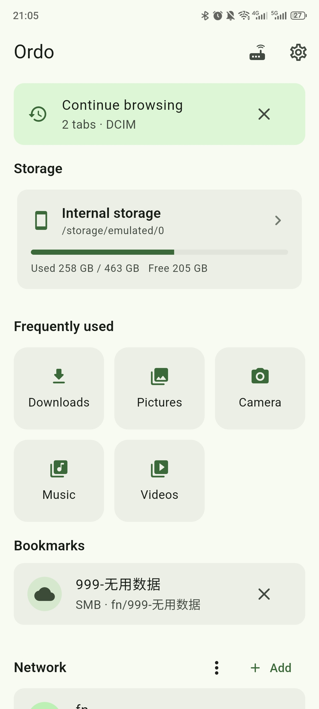
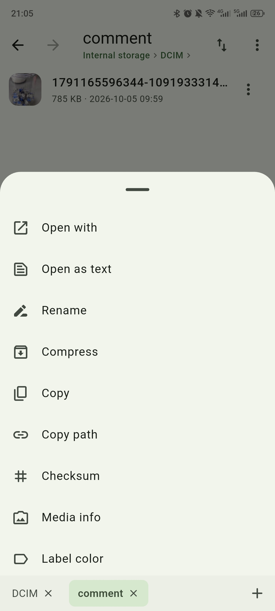
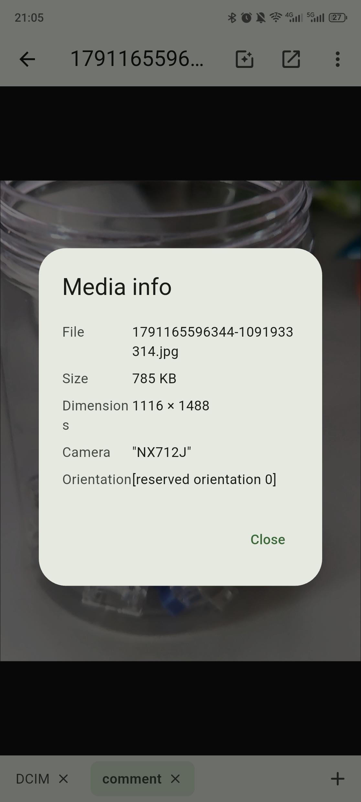

# Ordo 安序

**English** | [中文](README.zh-CN.md)

An Android file manager built with **Flutter + Rust**: the UI is drawn by Flutter, and every file operation is performed by Rust.

- UI (Flutter): Material 3, clean and practical.
- Core (Rust): all filesystem work happens in Rust and is exposed to Flutter over a minimal C ABI with JSON payloads.
- Targets ordinary (non-root) Android devices, using "All files access" (Android 11+) or the legacy read/write permissions.

> This project does **not** use Flutter's built-in file I/O APIs, and does **not** depend on any file-related third-party package. Dart only handles the UI and FFI calls; reading, writing, copying, moving, deleting, searching, archiving and analysis are all implemented in Rust.

## Screenshots

<p>
  
  
  
</p>

## Features

### Local file management

- Browse internal storage, removable SD cards and pluggable USB storage (flash drives / portable SSDs), with capacity usage
- **Hot-plug support**: listens to system storage broadcasts and refreshes automatically when a USB drive / SD card is inserted or removed; plugging in USB storage also makes Android offer Ordo, just like other file managers
- Quick-access folders (Downloads / Pictures / Camera / Music / Videos / Documents)
- Tappable path breadcrumb; favorites (bookmarks); **recent items**; in-directory **back / forward** navigation
- New folder / file, rename, delete (moved to the recycle bin by default, restorable / emptiable); create **symlinks**
- Multi-select, copy / cut / paste (across directories), with progress and cancel for large transfers
  - Selection tools: invert, select by type, select by condition (min size / recent days / extensions)
  - Copy path; pin a folder to the home screen as a **desktop shortcut**
- Sorting (name / size / modified time / type, ascending / descending), show / hide hidden files
- **Multi-tab browsing** with a bottom tab bar (switch / new / close)
- Copy / cut / paste run in a background **transfer queue** you can leave; cancel and retry supported
- **Color labels** for files (persisted per path)
- **Image / video thumbnails** (images are decoded and scaled by Rust and cached; videos use the system media framework)
- **Search**: recursive by name, plus **filters** (size / modified time /
  extensions / kind), **full-text content search** (text-like files, up to 2MB
  each) and **saved searches**
- Details sheet; **in-app preview for images / PDF / audio / text** (text can be
  lightly edited and saved), while video and other files are handed to the system
  "Open with"; share files
- **Images**: view **EXIF / media info**, rotate, save as, set as wallpaper
- **Audio**: background playback with play / pause from the notification and lock screen
- Tools: **file checksums** (SHA-256 / MD5) and **on-demand folder size**
- **Appearance**: theme (system / light / dark / **pure black**) with a custom
  accent colour; **home layout** (reorder / hide tools and quick folders);
  **list / grid view** with icon size; background transfers show progress in the
  notification
- **Settings**: choose a default app to open images / audio / video / text / PDF /
  APK and more (otherwise the system picker is shown every time); interface
  language (**system / 简体中文 / English**, follows the system by default);
  preferences are persisted in the app's private directory

### Browsing session

- Multi-tab browsing keeps a session; going back to the home page records it and shows a **Continue browsing** entry that restores every tab and its location
- The in-memory session is only cleared when the app is fully closed
- Optional **Remember last session** (Settings → General, off by default) keeps the session across app restarts
- Back navigation is per screen: the system back walks the current tab's in-page history (and any pushed viewer) one step at a time before returning to the home page, instead of jumping straight home

### Archives

- Create / extract / browse **ZIP, TAR and TAR.GZ**
- ZIP supports **AES-256 encryption** (optional password); encrypted archives prompt for the password when extracting
- Compress the current selection into the current folder; the archive viewer can **extract a single entry**

### Storage analysis

- Usage by category (images / video / audio / documents / archives / installers / text / other)
- Largest-files list with direct actions: open, open containing folder, share, move to recycle bin, delete permanently
- Duplicate detection (same size + SHA-256, two-pass), with one-tap cleanup
- **Smart cleanup**: categorises empty files, empty folders and temp / cache files for one-tap removal
- **Storage trend**: record directory usage snapshots and compare them over time

### Remote locations (WebDAV / FTP / SFTP / SMB, fully implemented in Rust)

- Connection management (add / edit / delete, test connection); profiles are stored in the app's private directory, with **import / export** and **QR sharing**
- Browsing, creating, renaming and deleting that behave like local storage, plus copy / move between local and remote (streamed)
- Remote **recursive search by name**
- Remote files can be previewed in-app, or downloaded to cache and opened with the system
- Files dragged in from other apps can be dropped straight into a remote folder

### On-device file server (HTTP/WebDAV + FTP)

- Start the server right on the phone and access it from other devices on the same LAN
- Browsers can browse / download directly, and also **upload files and create folders** from the web page (drag & drop supported)
- Windows / macOS / Linux can mount it as a network drive (WebDAV)
- FTP supports passive (PASV/EPSV) and active (PORT/EPRT) modes, read/write
- **Multiple users**: each account can be limited to a sub-folder and / or marked read-only (HTTP Basic and FTP USER/PASS)
- **Access log and current connections** (recent requests / active clients) shown on the server screen, clearable
- Optional single username / password and read-only mode; configuration is persisted and ports are configurable

### Security & privacy

- **App lock**: verifies the device lock-screen credential (PIN / pattern / password) on launch and on return to the foreground, using the native `KeyguardManager` (no third-party package)
- **Private vault**: moves files into the app's private directory so they are hidden from regular file managers, restorable or securely deletable
- **Secure delete**: overwrites file contents before deleting (note: due to wear levelling this has limited value on SSDs)

### Privileged access modes (Root / Shizuku / ADB)

On Android 11+ scoped storage, "All files access" still does **not** include `/sdcard/Android/data`, `/sdcard/Android/obb`, or another app's `/data/data`. Ordo can borrow a higher privilege to browse and manage those folders:

- **Root** — everything, including other apps' private `/data/data`
- **Shizuku** — `Android/data` and `Android/obb` (read/write) through an ADB-/root-level shell service
- **ADB** — the same capability by connecting directly to the device's own wireless-debugging `adbd` (no Shizuku app needed); pair once with the code shown in Developer options

All three share a single privileged helper process (`ordo-privd`), which is a second entry point of the same Rust core, so every file operation is still performed in Rust. The helper is deployed to `/data/local/tmp` and talks to the app over a token-protected loopback socket. Configure it in Settings → Security & privacy → Privileged mode.

### Diagnostics

- Uncaught Flutter / Dart errors and Rust panics are written to `ordo_crash.log` in the app's private directory
- View / export (to a chosen folder) / clear the log from Settings

### Cross-app drag & drop import

- In split-screen / multi-window, drag files from other apps (e.g. the gallery) straight into an Ordo window and they are copied into the folder you are currently viewing (local or remote)
- Android system drag & drop is received by the native layer, while the actual file write is still done by Rust

> This relies on Android's multi-window support (split-screen on Android 7.0+, or system drag & drop on Android 14+). Flutter does not provide this capability, so it is implemented natively with `View.OnDragListener`.

## Notes and limitations

- FTP is currently plaintext only (no FTPS). WebDAV supports HTTPS, with an option to trust self-signed certificates.
- The SMB share name may be left empty; the connection root then lists every share on the server.
- When acting as a server, FTP is also plaintext — use it only on a trusted LAN.
- External media: the app parses `/proc/self/mountinfo` and uses Android's `StorageManager` to detect SD cards and pluggable USB storage. Insertion / removal refreshes the list automatically, and returning to the foreground or pull-to-refresh also updates it. On some devices that do not expose the USB volume's underlying path to apps, the volume is still listed and marked "access not granted" instead of being hidden (a system limitation).
- Connection passwords are stored in the app's private directory in `ordo_connections.json` (plaintext, accessible only to this app).
- The app has no analytics or telemetry and uploads nothing to the developer; network traffic only occurs for the remote connections you configure and the local file server you start.
- Privileged modes are opt-in and do not survive a device reboot: Root, Shizuku and ADB all need to be (re)enabled once per boot. Root sees everything; Shizuku and ADB see `Android/data` and `Android/obb` but **not** other apps' `/data/data` (that is root-only).
- Deleting a file inside a privileged folder bypasses the recycle bin (it is permanently deleted).
- Modules that read files directly (thumbnails, EXIF, archive, storage analysis) may not work on privileged folders; browsing, opening, copying, renaming and deleting do.

## Architecture

```
lib/                      Flutter UI and FFI bindings
  src/ffi/native.dart     dart:ffi bindings + background isolate dispatch
  src/services/           filesystem facade / platform channels
  src/state/              browsing state, sorting prefs, clipboard, connections, drag & drop
  src/i18n/               lightweight zh / en localization
  src/ui/                 screens and widgets
rust/                     Rust core (cdylib)
  src/lib.rs              C ABI exports and panic guard
  src/api.rs              local filesystem implementation
  src/vfs.rs              unified facade: local paths and remote URIs share one interface
  src/storage.rs          storage volume discovery (internal / SD card / USB)
  src/importer.rs         drag & drop import (fd -> local / remote)
  src/favorites.rs        favorites persistence
  src/prefs.rs            UI preferences persistence (default open-with app, etc.)
  src/trash.rs            recycle bin (trash / restore / empty)
  src/jobs.rs             long-running job progress and cancellation
  src/archive.rs          archives: ZIP / TAR / TAR.GZ (with AES encryption)
  src/thumbnail.rs        image thumbnail decode and cache
  src/analyze.rs          storage analysis (categories / largest / duplicates)
  src/cleanup.rs          smart cleanup scan (empty files / folders, temp files)
  src/trend.rs            storage usage snapshots and history
  src/media.rs            EXIF / media info
  src/image_ops.rs        image rotation
  src/secure.rs           secure delete (overwrite then remove)
  src/vault.rs            private vault (move into app-private storage)
  src/qr.rs               QR code PNG generation
  src/crash.rs            crash / error log persistence
  src/privileged.rs       high-privilege backend client (Root / Shizuku / ADB)
  src/bin/ordo_privd.rs   privileged helper process (same core, shell/root uid)
  src/remote/             WebDAV / FTP / SFTP / SMB clients and connection sessions
  src/server/             HTTP/WebDAV and FTP servers
  src/model.rs            metadata models
android/                  Android project
  app/.../MainActivity.kt storage permissions, open / share, cross-app drop, USB events, app lock
  app/.../AudioPlayback.kt audio foreground service + media session
  app/.../TransferService.kt transfer progress foreground service
  app/.../PrivilegeManager.kt deploy & start the helper as root / via Shizuku / via ADB
  app/.../AdbManager.kt   direct ADB (wireless debugging) connection & pairing
  app/build.gradle.kts    runs cargo-ndk to build Rust into jniLibs (and the helper into assets)
scripts/                  manual build scripts
```

Remote locations are represented as URIs: `<scheme>://<connection-id>/path`, for example
`smb://ab12cd/Documents/report.pdf`. Dart only passes strings; protocol implementation and connection reuse live entirely in Rust.

Every native function returns either `{"ok":true,"data":...}` or
`{"ok":false,"error":"..."}`; strings are allocated by Rust and freed by Dart.

## Version

The app version is sourced from a single file, `VERSION` at the repository root, currently **1.0** (two-part `major.minor`). The Rust core reads it with `include_str!` and returns it via `ping`; Android's `versionName` is read from the same file by Gradle. `pubspec.yaml` keeps `1.0.0+build` because Dart requires three parts — it is only used by the Flutter toolchain.

## Requirements

- Flutter (with the Android toolchain enabled)
- Rust and the Android targets:
  ```sh
  rustup target add aarch64-linux-android armv7-linux-androideabi x86_64-linux-android
  cargo install cargo-ndk
  ```
- Android NDK (bundled with Android Studio, or installed separately with `ANDROID_NDK_HOME` set)

## Build and run

Gradle automatically invokes `cargo-ndk` to build the Rust core before building the APK (see the `cargoNdkBuild` task in `android/app/build.gradle.kts`):

```sh
flutter run --release
# or
flutter build apk --release
```

Build arm64-v8a only (both Rust and Flutter are compiled for this ABI):

```sh
flutter build apk --release \
  --target-platform android-arm64 \
  -P ordo.rustAbis=arm64-v8a
```

Build the Rust core manually (output goes to `android/app/src/main/jniLibs`):

```sh
./scripts/build_rust_android.sh
```

On first launch the app asks for "All files access"; follow the prompt to grant it in system settings.

## Testing

```sh
# Rust unit tests
cargo test --manifest-path rust/Cargo.toml

# Dart unit tests (pure logic)
flutter test

# Full Dart <-> Rust integration tests on desktop using the dynamic library
cargo build --manifest-path rust/Cargo.toml
ORDO_CORE_LIB="$PWD/rust/target/debug/libordo_core.dylib" \
  flutter test test/ffi_integration_test.dart
```

## License

Ordo is released under the [MIT License](LICENSE).

- Repository: <https://github.com/whynbnb/ordo>
