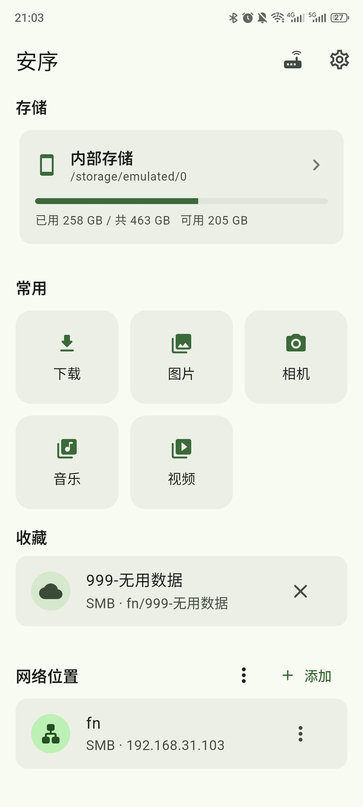
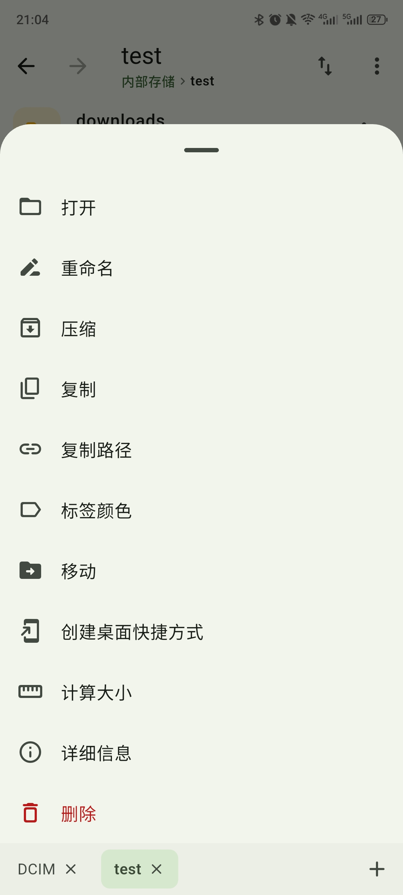
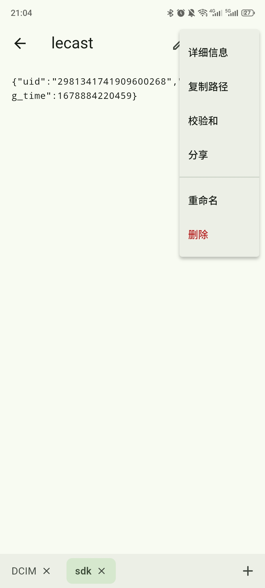

# 安序 Ordo

[English](README.md) | **中文**

一个使用 **Flutter + Rust** 构建的安卓文件管理器：界面由 Flutter 绘制，所有文件操作都在 Rust 中完成。

- **界面（Flutter）**：Material 3，简洁实用。
- **核心（Rust）**：所有文件系统操作都在 Rust 中完成，通过一层极简的 C ABI 以 JSON 形式与 Flutter 通信。
- **面向非 root 设备**：使用「所有文件访问权限」（Android 11+）或旧版读写权限，并可选 Root / Shizuku / ADB 访问受限目录。

> 本项目**不使用** Flutter 自带的文件读写 API，也**不引入任何文件相关的第三方包**。Dart 侧只负责界面与 FFI 调用，实际的读 / 写 / 复制 / 移动 / 删除 / 搜索 / 压缩 / 分析全部由 Rust 实现。

## 截图

<p>
  
  
  
</p>

## 功能

**本地文件**
- 浏览内部存储、存储卡与 USB 存储（U 盘 / 移动硬盘），展示容量占用；插拔存储自动检测并刷新。
- 常用目录快捷入口、可点击的路径面包屑、收藏夹、最近访问、目录内前进 / 后退。
- 新建文件夹 / 文件、重命名、删除（默认移入回收站）、创建符号链接；多选复制 / 剪切 / 粘贴，带进度与后台传输队列（可取消 / 重试）。
- 排序、显示 / 隐藏隐藏文件、文件标签颜色标记、图片 / 视频缩略图。

**标签页与会话**
- 多标签浏览：底部标签栏可切换 / 新建 / 关闭，并带一个 **Home** 按钮可一键回到首页。
- 回到首页会记录会话，并出现「**继续浏览**」入口，可恢复全部标签及其所在目录；内存中的会话在应用完全关闭后才清除。
- 设置 → 常规：**记住上次会话**（默认关闭）；**显示 / 隐藏标签栏**（隐藏即单标签浏览）；以及从首页打开目录时是**附加**到当前会话还是**重置**（默认重置）。
- 返回按层级进行：系统返回先逐级回退当前标签页的页内历史，最后才回到首页。

**查看与工具**
- 应用内预览图片 / PDF / 音频 / 文本（文本可简单编辑）；视频等其余文件交给系统「打开方式」；分享文件。
- 查看 EXIF / 媒体信息，旋转、另存为、设为壁纸；音频后台播放（通知栏 / 锁屏可控）。
- 文件校验和（SHA-256 / MD5）、文件夹大小按需统计。
- 搜索：按名称递归搜索、过滤（大小 / 时间 / 扩展名 / 类型）、全文内容搜索、保存的搜索。
- 外观：主题（跟随系统 / 浅色 / 深色 / 纯黑）、自定义主色、首页布局、列表 / 网格与图标大小。
- 为「打开方式」指定默认应用；界面语言（跟随系统 / 简体中文 / English，默认跟随系统）。

**压缩 / 归档**
- 创建 / 解压 / 查看 ZIP、TAR、TAR.GZ；ZIP 支持 AES-256 加密（可选密码）。

**存储分析**
- 分类占用、最大文件、重复文件检测、智能清理（空文件 / 空目录 / 临时文件）、存储趋势。

**远程位置**（WebDAV / FTP / SFTP / SMB，全部由 Rust 实现）
- 连接管理（增删改、测试连接），支持导入 / 导出与二维码分享。
- 与本地一致的浏览、新建、重命名、删除；本地与远程之间复制 / 移动；远程按名称递归搜索。
- 远程文件可在应用内预览，或下载到缓存后交给系统打开；从其它应用拖入的文件可直接落到远程目录。

**本机文件服务器**（HTTP/WebDAV + FTP）
- 在手机上直接开启服务供局域网访问：浏览器可浏览 / 下载，并可上传文件、新建文件夹。
- 可通过 WebDAV 映射为网络驱动器（Windows / macOS / Linux）；FTP 支持被动与主动模式。
- 多用户（每个账号可限定子目录、可设为只读）、访问日志与当前连接。

**安全与隐私**
- 应用锁：启动或回到前台时验证设备锁屏凭证。
- 隐私空间：把文件移入应用私有目录，常规文件管理器中不可见。
- 安全删除：删除前先覆盖写入（SSD 因磨损均衡，意义有限）。

**高权限模式**（Root / Shizuku / ADB）
- Android 11+ 下「所有文件访问」仍不包含 `Android/data`、`Android/obb` 及其它应用的 `/data/data`；安序可借用更高权限来管理这些目录。
- **Root** 可见全部文件；**Shizuku** 与 **ADB** 可访问 `Android/data` 与 `Android/obb`（ADB 无需安装 Shizuku，用开发者选项中的配对码配对一次即可）。
- 三种模式共用同一个 Rust 辅助进程 `ordo-privd`，通过带令牌鉴权的本地回环套接字通信。在「设置 → 安全与隐私 → 权限模式」中配置。

**诊断与拖放**
- Flutter / Dart 未捕获异常与 Rust panic 会记录到日志文件，可在设置中查看 / 导出 / 清空。
- 在分屏 / 多窗口下，把相册等其它应用的文件直接拖入安序窗口，即可复制到当前浏览的目录。

## 说明与限制

- FTP 仅支持明文（未实现 FTPS）；WebDAV 支持 HTTPS 且可选择信任自签名证书。内置 FTP 服务同样为明文，请仅在可信局域网中使用。
- SMB 的共享名可以留空，此时连接根目录会列出服务器上的全部共享。
- 连接密码以明文保存在应用私有目录的 `ordo_connections.json`。
- 应用没有统计 / 上报，不会向开发者上传任何数据；只有你主动配置的远程连接与局域网文件服务器会产生网络流量。
- 高权限模式需手动开启且**重启后不保留**。Root 可见全部文件；Shizuku 与 ADB **看不到**其它应用的 `/data/data`。在受保护目录中删除会跳过回收站，且直接读取文件的模块（缩略图、EXIF、压缩包、存储分析）可能不可用。
- 部分设备若未向应用开放 USB 卷的底层路径，仍会列出该卷并标注「未开放访问」，而不是直接隐藏（受系统限制）。

## 架构

```
lib/                      Flutter 界面与 FFI 绑定
  src/ffi/native.dart     dart:ffi 绑定 + 后台 isolate 调度
  src/services/           文件系统门面 / 平台通道
  src/state/              浏览状态、排序偏好、剪贴板、连接配置、拖放
  src/i18n/               轻量中英文本地化
  src/ui/                 各页面与组件
rust/                     Rust 核心（cdylib）
  src/lib.rs              C ABI 导出与 panic 防护
  src/api.rs              本地文件系统实现
  src/vfs.rs              统一门面：本地路径与远程 URI 走同一接口
  src/storage.rs          存储卷发现（内部 / 存储卡 / USB）
  src/importer.rs         跨应用拖放文件的导入（fd → 本地 / 远程）
  src/favorites.rs        收藏夹持久化
  src/prefs.rs            界面偏好持久化（默认打开方式等）
  src/trash.rs            回收站（移入 / 恢复 / 清空）
  src/jobs.rs             长任务进度与取消
  src/archive.rs          归档 ZIP / TAR / TAR.GZ（含 AES 加密）
  src/thumbnail.rs        图片缩略图解码与缓存
  src/analyze.rs          存储分析（分类 / 大文件 / 重复）
  src/cleanup.rs          智能清理扫描（空文件 / 空目录 / 临时文件）
  src/trend.rs            存储用量快照与历史
  src/media.rs            EXIF / 媒体信息
  src/image_ops.rs        图片旋转
  src/secure.rs           安全删除（覆盖写后删除）
  src/vault.rs            隐私空间（移入应用私有目录）
  src/qr.rs               二维码 PNG 生成
  src/crash.rs            崩溃 / 错误日志持久化
  src/privileged.rs       高权限后端客户端（Root / Shizuku / ADB）
  src/bin/ordo_privd.rs   高权限辅助进程（同一核心，以 shell / root 身份运行）
  src/remote/             WebDAV / FTP / SFTP / SMB 客户端与连接会话
  src/server/             HTTP/WebDAV 与 FTP 服务端
  src/model.rs            元数据模型
android/                  Android 工程
  app/.../MainActivity.kt 存储权限、文件打开 / 分享、跨应用拖放接收、USB 插拔、应用锁
  app/.../AudioPlayback.kt 音频前台服务 + 媒体会话
  app/.../TransferService.kt 传输进度前台服务
  app/.../PrivilegeManager.kt 以 root / Shizuku / ADB 部署并启动辅助进程
  app/.../AdbManager.kt   直接连接本机 ADB（无线调试）与配对
  app/build.gradle.kts    调用 cargo-ndk 编译 Rust 放入 jniLibs（辅助进程放入 assets）
scripts/                  手动构建脚本
```

远程位置以 URI 形式表示：`<scheme>://<连接ID>/路径`，例如
`smb://ab12cd/文档/report.pdf`。Dart 侧只传字符串，协议实现与连接复用都在 Rust 中完成。

所有原生函数的返回值都是 `{"ok":true,"data":...}` 或
`{"ok":false,"error":"..."}`，字符串内存由 Rust 分配、Dart 释放。

## 版本

应用版本号以仓库根目录的 `VERSION` 文件为唯一来源，当前为 **1.0**（两段式
`主版本.次版本`）。Rust 核心通过 `include_str!` 读取该文件并随 `ping` 返回，
Android 的 `versionName` 由 Gradle 读取同一文件；`pubspec.yaml` 因 Dart 要求
三段式而保留 `1.0.0+build`，仅用于 Flutter 工具链。

## 环境要求

- Flutter（已启用 Android 工具链）
- Rust 与 Android 目标：
  ```sh
  rustup target add aarch64-linux-android armv7-linux-androideabi x86_64-linux-android
  cargo install cargo-ndk
  ```
- Android NDK（Android Studio 自带，或单独安装并设置 `ANDROID_NDK_HOME`）

## 构建与运行

Gradle 会在构建 APK 前自动调用 `cargo-ndk` 编译 Rust（见
`android/app/build.gradle.kts` 中的 `cargoNdkBuild` 任务）：

```sh
flutter run --release
# 或
flutter build apk --release
```

只打包 arm64-v8a（Rust 与 Flutter 都只编译该架构）：

```sh
flutter build apk --release \
  --target-platform android-arm64 \
  -P ordo.rustAbis=arm64-v8a
```

手动编译 Rust 核心（产物放入 `android/app/src/main/jniLibs`）：

```sh
./scripts/build_rust_android.sh
```

首次启动时应用会请求「所有文件访问权限」，请按提示前往系统设置授权。

## 测试

```sh
# Rust 单元测试
cargo test --manifest-path rust/Cargo.toml

# Dart 单元测试（含纯逻辑）
flutter test

# 桌面端可用动态库跑完整的 Dart <-> Rust 集成测试
cargo build --manifest-path rust/Cargo.toml
ORDO_CORE_LIB="$PWD/rust/target/debug/libordo_core.dylib" \
  flutter test test/ffi_integration_test.dart
```

## 许可证

安序以 [MIT 许可证](LICENSE) 开源。

- 仓库地址：<https://github.com/whynbnb/ordo>
